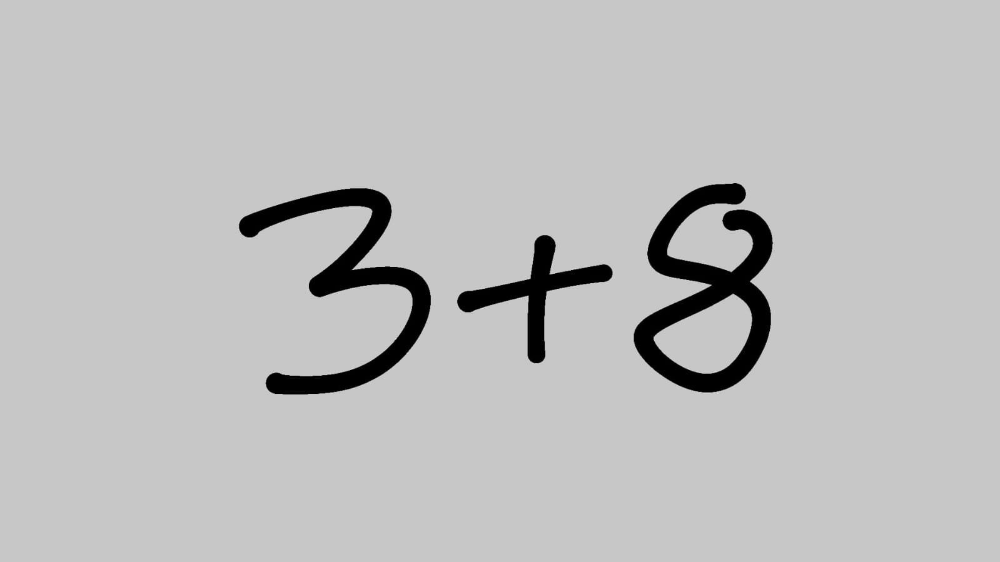

# PhotomathDemo
photomath-demo.herokuapp.com/

A very simple web applications that recognizes handwritten digits and operators + and -.
Right now it can only work properly on images with vertical characters.
If you upload an image that is rotated, you must select is it right or left rotated for program to work properly.
There isn't any mechanism to control whether a recognized character really is a digit or + or -.
Example of an input:

Model trained on a kaggle dataset: https://www.kaggle.com/xainano/handwrittenmathsymbols
